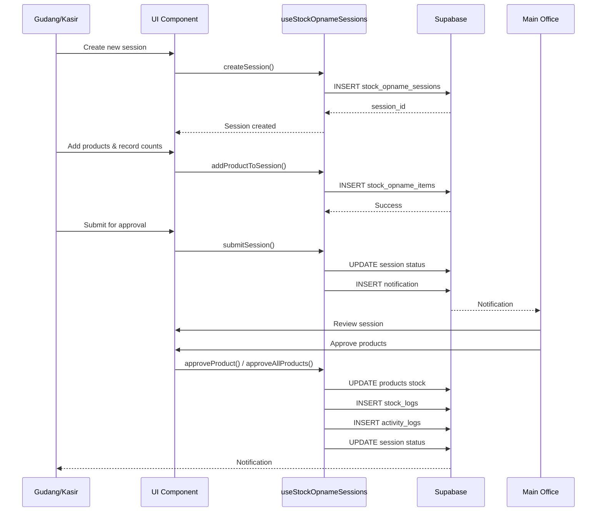

# Design Document: Stok Opname

## Overview

The Stok Opname feature enables warehouse and cashier roles to perform physical stock counts and reconcile discrepancies between system stock and physical stock. The system uses a session-based approach where users create a stock opname session, add products to count, record physical quantities (with multi-unit support), and submit for approval by the main office role. This design transforms the current single-record approach into a comprehensive session-based workflow with enhanced multi-unit capabilities.

### Key Design Decisions

1. **Session-Based Workflow**: Instead of individual stock opname records, we use sessions that group multiple product counts together, allowing batch processing and better audit trails
2. **Multi-Unit Support**: Full integration with the existing multi-unit system (main_unit/sell_unit/pcs_per_box) for flexible stock counting
3. **Granular Approval**: Office can approve individual products or entire sessions, providing flexibility in the approval process
4. **Draft State**: Sessions remain in draft until submitted, allowing users to build up their count over time
5. **Immutable After Submission**: Once submitted, sessions cannot be edited to maintain data integrity
6. **Comprehensive Logging**: All stock adjustments are logged with full context for audit purposes

## Architecture

### System Components

```
┌─────────────────────────────────────────────────────────────┐
│                     Presentation Layer                       │
├─────────────────────────────────────────────────────────────┤
│  StockOpnameSession (Page)                                   │
│  ├─ SessionList (Component)                                  │
│  ├─ SessionForm (Component)                                  │
│  ├─ ProductSelector (Component)                              │
│  ├─ MultiUnitInput (Component)                               │
│  └─ ApprovalInterface (Component)                            │
└─────────────────────────────────────────────────────────────┘
                            │
                            ▼
┌─────────────────────────────────────────────────────────────┐
│                      Business Logic Layer                    │
├─────────────────────────────────────────────────────────────┤
│  useStockOpnameSessions (Hook)                               │
│  ├─ createSession()                                          │
│  ├─ addProductToSession()                                    │
│  ├─ updateProductInSession()                                 │
│  ├─ removeProductFromSession()                               │
│  ├─ submitSession()                                          │
│  ├─ approveProduct()                                         │
│  ├─ approveAllProducts()                                     │
│  └─ rejectSession()                                          │
└─────────────────────────────────────────────────────────────┘
                            │
                            ▼
┌─────────────────────────────────────────────────────────────┐
│                       Data Layer                             │
├─────────────────────────────────────────────────────────────┤
│  Supabase Tables:                                            │
│  ├─ stock_opname_sessions                                    │
│  ├─ stock_opname_items                                       │
│  ├─ products                                                 │
│  ├─ stock_logs                                               │
│  ├─ activity_logs                                            │
│  └─ notifications                                            │
└─────────────────────────────────────────────────────────────┘
```

### Data Flow



## Components and Interfaces

### Database Schema

#### stock_opname_sessions Table

```sql
CREATE TABLE stock_opname_sessions (
  id UUID PRIMARY KEY DEFAULT gen_random_uuid(),
  session_number TEXT UNIQUE NOT NULL, -- Format: SO-YYYYMMDD-XXXX
  location TEXT NOT NULL CHECK (location IN ('gudang', 'toko')),
  status TEXT NOT NULL DEFAULT 'draft' CHECK (status IN ('draft', 'pending_approval', 'approved', 'rejected', 'completed')),
  
  -- User tracking
  created_by UUID REFERENCES auth.users(id),
  created_by_name TEXT NOT NULL,
  
  -- Approval tracking
  approved_by UUID REFERENCES auth.users(id),
  approved_by_name TEXT,
  approved_at TIMESTAMPTZ,
  rejected_reason TEXT,
  
  -- Timestamps
  submitted_at TIMESTAMPTZ,
  created_at TIMESTAMPTZ DEFAULT NOW(),
  updated_at TIMESTAMPTZ DEFAULT NOW()
);

CREATE INDEX idx_stock_opname_sessions_status ON stock_opname_sessions(status);
CREATE INDEX idx_stock_opname_sessions_location ON stock_opname_sessions(location);
CREATE INDEX idx_stock_opname_sessions_created_by ON stock_opname_sessions(created_by);
```

#### stock_opname_items Table

```sql
CREATE TABLE stock_opname_items (
  id UUID PRIMARY KEY DEFAULT gen_random_uuid(),
  session_id UUID NOT NULL REFERENCES stock_opname_sessions(id) ON DELETE CASCADE,
  product_id UUID NOT NULL REFERENCES products(id),
  
  -- Stock data (snapshot at time of creation)
  system_stock DECIMAL(10,2) NOT NULL,
  actual_stock DECIMAL(10,2) NOT NULL,
  difference DECIMAL(10,2) NOT NULL, -- actual_stock - system_stock
  
  -- Multi-unit tracking
  unit_used TEXT, -- Which unit was used for counting (main_unit or sell_unit)
  main_unit_count DECIMAL(10,2), -- Count in main_unit (if applicable)
  sub_unit_count DECIMAL(10,2), -- Count in sell_unit
  
  -- Additional info
  note TEXT,
  
  -- Approval status per item
  status TEXT NOT NULL DEFAULT 'pending' CHECK (status IN ('pending', 'approved', 'rejected')),
  approved_by UUID REFERENCES auth.users(id),
  approved_by_name TEXT,
  approved_at TIMESTAMPTZ,
  
  created_at TIMESTAMPTZ DEFAULT NOW(),
  
  UNIQUE(session_id, product_id)
);

CREATE INDEX idx_stock_opname_items_session ON stock_opname_items(session_id);
CREATE INDEX idx_stock_opname_items_product ON stock_opname_items(product_id);
CREATE INDEX idx_stock_opname_items_status ON stock_opname_items(status);
```

### TypeScript Interfaces

```typescript
export type StockOpnameSessionStatus = 
  | 'draft' 
  | 'pending_approval' 
  | 'approved' 
  | 'rejected' 
  | 'completed';

export type StockOpnameItemStatus = 
  | 'pending' 
  | 'approved' 
  | 'rejected';

export interface StockOpnameSession {
  id: string;
  session_number: string;
  location: Location;
  status: StockOpnameSessionStatus;
  
  created_by: string | null;
  created_by_name: string;
  
  approved_by?: string | null;
  approved_by_name?: string | null;
  approved_at?: string | null;
  rejected_reason?: string | null;
  
  submitted_at?: string | null;
  created_at: string;
  updated_at: string;
  
  items?: StockOpnameItem[];
}

export interface StockOpnameItem {
  id: string;
  session_id: string;
  product_id: string;
  product?: Product;
  
  system_stock: number;
  actual_stock: number;
  difference: number;
  
  unit_used?: string | null;
  main_unit_count?: number | null;
  sub_unit_count?: number | null;
  
  note?: string | null;
  
  status: StockOpnameItemStatus;
  approved_by?: string | null;
  approved_by_name?: string | null;
  approved_at?: string | null;
  
  created_at: string;
}
```

### API Endpoints (Supabase RPC Functions)

#### generate_stock_opname_number

```sql
CREATE OR REPLACE FUNCTION generate_stock_opname_number()
RETURNS TEXT AS $$
DECLARE
  today TEXT;
  seq INT;
  result TEXT;
BEGIN
  today := TO_CHAR(NOW(), 'YYYYMMDD');
  
  SELECT COALESCE(MAX(
    CAST(SUBSTRING(session_number FROM 'SO-[0-9]{8}-([0-9]{4})') AS INT)
  ), 0) + 1
  INTO seq
  FROM stock_opname_sessions
  WHERE session_number LIKE 'SO-' || today || '-%';
  
  result := 'SO-' || today || '-' || LPAD(seq::TEXT, 4, '0');
  RETURN result;
END;
$$ LANGUAGE plpgsql;
```

#### approve_stock_opname_item

```sql
CREATE OR REPLACE FUNCTION approve_stock_opname_item(
  p_item_id UUID,
  p_approver_id UUID,
  p_approver_name TEXT
)
RETURNS JSON AS $$
DECLARE
  v_item RECORD;
  v_product RECORD;
  v_stock_field TEXT;
  v_current_stock DECIMAL;
  v_new_stock DECIMAL;
  v_result JSON;
BEGIN
  -- Get item details
  SELECT * INTO v_item
  FROM stock_opname_items
  WHERE id = p_item_id AND status = 'pending';
  
  IF NOT FOUND THEN
    RAISE EXCEPTION 'Item not found or already processed';
  END IF;
  
  -- Get product and current stock
  SELECT * INTO v_product
  FROM products
  WHERE id = v_item.product_id;
  
  -- Determine stock field based on session location
  SELECT location INTO v_stock_field
  FROM stock_opname_sessions
  WHERE id = v_item.session_id;
  
  IF v_stock_field = 'gudang' THEN
    v_current_stock := v_product.stock_gudang;
    v_stock_field := 'stock_gudang';
  ELSIF v_stock_field = 'toko' THEN
    v_current_stock := v_product.stock_toko;
    v_stock_field := 'stock_toko';
  END IF;
  
  -- Calculate new stock (apply difference to current stock)
  v_new_stock := GREATEST(0, v_current_stock + v_item.difference);
  
  -- Update product stock
  EXECUTE format('UPDATE products SET %I = $1, updated_at = NOW() WHERE id = $2',
    v_stock_field)
  USING v_new_stock, v_item.product_id;
  
  -- Update item status
  UPDATE stock_opname_items
  SET status = 'approved',
      approved_by = p_approver_id,
      approved_by_name = p_approver_name,
      approved_at = NOW()
  WHERE id = p_item_id;
  
  -- Insert stock log
  INSERT INTO stock_logs (
    product_id,
    type,
    quantity,
    location,
    user_id,
    note,
    reference_type,
    reference_id,
    stock_before,
    stock_after
  ) VALUES (
    v_item.product_id,
    'adjustment',
    v_item.difference,
    (SELECT location FROM stock_opname_sessions WHERE id = v_item.session_id),
    p_approver_id,
    COALESCE('Stok opname: ' || v_item.note, 'Stok opname'),
    'stock_opname_item',
    v_item.id,
    v_current_stock,
    v_new_stock
  );
  
  -- Insert activity log
  INSERT INTO activity_logs (
    user_id,
    user_name,
    user_role,
    action,
    entity_type,
    entity_id,
    description
  ) VALUES (
    p_approver_id,
    p_approver_name,
    'main_office',
    'approve_stock_adjustment',
    'stock_opname_item',
    p_item_id,
    format('Approved stock adjustment for %s: %s → %s (diff: %s)',
      v_product.name,
      v_current_stock,
      v_new_stock,
      v_item.difference)
  );
  
  v_result := json_build_object(
    'success', true,
    'item_id', p_item_id,
    'old_stock', v_current_stock,
    'new_stock', v_new_stock,
    'difference', v_item.difference
  );
  
  RETURN v_result;
END;
$$ LANGUAGE plpgsql;
```

### React Hooks

#### useStockOpnameSessions

```typescript
export function useStockOpnameSessions(filters?: {
  status?: StockOpnameSessionStatus;
  location?: Location;
  dateFrom?: string;
  dateTo?: string;
}) {
  return useQuery({
    queryKey: ['stock-opname-sessions', filters],
    queryFn: async () => {
      let query = supabase
        .from('stock_opname_sessions')
        .select(`
          *,
          items:stock_opname_items(
            *,
            product:products(*)
          )
        `)
        .order('created_at', { ascending: false });
      
      if (filters?.status) {
        query = query.eq('status', filters.status);
      }
      if (filters?.location) {
        query = query.eq('location', filters.location);
      }
      if (filters?.dateFrom) {
        query = query.gte('created_at', filters.dateFrom);
      }
      if (filters?.dateTo) {
        query = query.lte('created_at', filters.dateTo);
      }
      
      const { data, error } = await query;
      if (error) throw error;
      return data as StockOpnameSession[];
    },
  });
}
```

#### useCreateStockOpnameSession

```typescript
export function useCreateStockOpnameSession() {
  const queryClient = useQueryClient();
  const { toast } = useToast();
  
  return useMutation({
    mutationFn: async ({
      location,
      userId,
      userName,
    }: {
      location: Location;
      userId: string;
      userName: string;
    }) => {
      // Generate session number
      const { data: sessionNumber, error: numberError } = await supabase
        .rpc('generate_stock_opname_number');
      
      if (numberError) throw numberError;
      
      // Create session
      const { data, error } = await supabase
        .from('stock_opname_sessions')
        .insert({
          session_number: sessionNumber,
          location,
          status: 'draft',
          created_by: userId,
          created_by_name: userName,
        })
        .select()
        .single();
      
      if (error) throw error;
      return data as StockOpnameSession;
    },
    onSuccess: () => {
      queryClient.invalidateQueries({ queryKey: ['stock-opname-sessions'] });
      toast({
        title: 'Session Created',
        description: 'Stock opname session has been created',
      });
    },
  });
}
```

## Data Models

### Session State Machine

```
draft → pending_approval → completed
                ↓
            rejected
```

States:
- **draft**: Session is being built, items can be added/edited/removed
- **pending_approval**: Session submitted, waiting for office approval
- **approved**: All items approved (intermediate state)
- **completed**: Session fully processed, all stock adjustments applied
- **rejected**: Session rejected by office, no stock changes applied

### Item State Machine

```
pending → approved
    ↓
rejected
```

States:
- **pending**: Item waiting for approval
- **approved**: Item approved, stock adjusted
- **rejected**: Item rejected (currently not used, but available for future granular rejection)

### Multi-Unit Calculation Logic

When a product has multi-unit support (`has_multi_unit = true` and `pcs_per_box > 0`):

1. **Input**: User can enter count in:
   - Main unit only (e.g., 5 boxes)
   - Sub unit only (e.g., 350 pcs)
   - Combination (e.g., 5 boxes + 50 pcs)

2. **Conversion to base unit** (sell_unit):
   ```
   total_in_sub_unit = (main_unit_count × pcs_per_box) + sub_unit_count
   ```

3. **Difference calculation**:
   ```
   difference = actual_stock - system_stock
   ```
   (both in sub_unit)

4. **Display**: Show in user-friendly format:
   ```
   formatMultiUnitStock(stock, pcs_per_box, main_unit, sell_unit)
   → "5 SAK 50 KG" or "350 KG"
   ```

### Stock Adjustment Logic

When approving an item:

1. Read current stock from database (fresh read to handle concurrent changes)
2. Apply difference: `new_stock = current_stock + difference`
3. Ensure non-negative: `new_stock = max(0, new_stock)`
4. Update product stock
5. Log adjustment with before/after values

This approach handles race conditions better than overwriting with `actual_stock` directly.

## Error Handling

### Validation Rules

1. **Session Creation**:
   - User must have role 'warehouse', 'cashier', or 'admin'
   - Location must be 'gudang' or 'toko'

2. **Adding Products**:
   - Product must exist
   - Product cannot be added twice to same session
   - Session must be in 'draft' status

3. **Recording Physical Stock**:
   - Actual stock must be non-negative
   - For multi-unit products, conversion must use valid pcs_per_box

4. **Submitting Session**:
   - Session must have at least one item
   - Session must be in 'draft' status
   - User must be the creator or have admin role

5. **Approving Items**:
   - User must have role 'main_office' or 'admin'
   - Session must be in 'pending_approval' status
   - Item must be in 'pending' status
   - Product must still exist

6. **Rejecting Session**:
   - User must have role 'main_office' or 'admin'
   - Session must be in 'pending_approval' status
   - Rejection reason is required

### Error Messages

```typescript
const ERROR_MESSAGES = {
  SESSION_NOT_DRAFT: 'Cannot modify session that is not in draft status',
  SESSION_EMPTY: 'Cannot submit empty session',
  PRODUCT_ALREADY_ADDED: 'Product already added to this session',
  INVALID_STOCK_VALUE: 'Stock value must be non-negative',
  UNAUTHORIZED: 'You do not have permission to perform this action',
  SESSION_NOT_FOUND: 'Session not found',
  ITEM_NOT_FOUND: 'Item not found',
  PRODUCT_NOT_FOUND: 'Product not found',
  CONCURRENT_MODIFICATION: 'Session was modified by another user. Please refresh.',
};
```

### Error Handling Strategy

1. **Client-side validation**: Validate inputs before API calls
2. **Optimistic updates**: Update UI immediately, rollback on error
3. **Toast notifications**: Show user-friendly error messages
4. **Logging**: Log errors to console for debugging
5. **Retry logic**: For transient errors (network issues)
6. **Conflict resolution**: Detect concurrent modifications using timestamps

## Testing Strategy

### Unit Tests

1. **Multi-unit conversion functions**:
   - Test conversion from main_unit to sell_unit
   - Test conversion from combination to sell_unit
   - Test formatting for display
   - Edge cases: zero values, decimal values, null pcs_per_box

2. **Difference calculation**:
   - Test positive differences (surplus)
   - Test negative differences (shortage)
   - Test zero difference
   - Test with multi-unit products

3. **Validation functions**:
   - Test all validation rules
   - Test error message generation

4. **State machine transitions**:
   - Test valid transitions
   - Test invalid transitions
   - Test state guards

### Integration Tests

1. **Session workflow**:
   - Create session → Add products → Submit → Approve → Verify stock updated
   - Create session → Add products → Submit → Reject → Verify stock unchanged

2. **Multi-user scenarios**:
   - Warehouse creates session, Office approves
   - Cashier creates session, Office rejects

3. **Concurrent access**:
   - Two users try to approve same item
   - User tries to edit session while Office is reviewing

4. **Stock adjustment accuracy**:
   - Verify stock logs are created correctly
   - Verify activity logs are created correctly
   - Verify notifications are sent

### End-to-End Tests

1. **Complete opname flow**:
   - Login as warehouse user
   - Create new session
   - Add multiple products (mix of single-unit and multi-unit)
   - Record physical counts
   - Submit for approval
   - Login as office user
   - Review and approve session
   - Verify stock updated in products page

2. **Error scenarios**:
   - Try to submit empty session
   - Try to add same product twice
   - Try to edit submitted session
   - Try to approve as non-office user

### Test Data

```typescript
const TEST_PRODUCTS = [
  {
    id: 'prod-1',
    name: 'Semen Gresik',
    barcode: '8991234567890',
    has_multi_unit: true,
    main_unit: 'sak',
    sell_unit: 'kg',
    pcs_per_box: 50,
    stock: { gudang: 250, toko: 100 }, // 5 sak, 2 sak
  },
  {
    id: 'prod-2',
    name: 'Paku 5cm',
    barcode: '8991234567891',
    has_multi_unit: false,
    sell_unit: 'pcs',
    stock: { gudang: 1000, toko: 500 },
  },
];

const TEST_SESSION = {
  id: 'session-1',
  session_number: 'SO-20240115-0001',
  location: 'gudang',
  status: 'draft',
  created_by: 'user-1',
  created_by_name: 'John Warehouse',
};
```

## Implementation Plan

### Phase 1: Database Setup
1. Create `stock_opname_sessions` table
2. Create `stock_opname_items` table
3. Create RPC functions
4. Create indexes
5. Set up RLS policies

### Phase 2: Backend Logic
1. Implement `useStockOpnameSessions` hook
2. Implement `useCreateStockOpnameSession` hook
3. Implement `useAddProductToSession` hook
4. Implement `useSubmitSession` hook
5. Implement `useApproveItem` and `useApproveAllItems` hooks
6. Implement `useRejectSession` hook

### Phase 3: UI Components
1. Create `SessionList` component
2. Create `SessionForm` component
3. Create `ProductSelector` with barcode scanner
4. Create `MultiUnitInput` component
5. Create `SessionSummary` component
6. Create `ApprovalInterface` component

### Phase 4: Integration
1. Integrate with existing stock management
2. Integrate with notifications system
3. Integrate with activity logs
4. Add to navigation/routing

### Phase 5: Testing & Polish
1. Write unit tests
2. Write integration tests
3. Perform user acceptance testing
4. Fix bugs and refine UX
5. Add export functionality
6. Performance optimization

## Migration Strategy

### Migrating Existing Data

The current system has a `stock_opname` table with individual records. Migration strategy:

1. **Keep old table**: Rename to `stock_opname_legacy` for historical reference
2. **Create new tables**: `stock_opname_sessions` and `stock_opname_items`
3. **Optional migration script**: Convert old records to new format (each old record becomes a session with one item)

```sql
-- Migration script (optional)
INSERT INTO stock_opname_sessions (
  id,
  session_number,
  location,
  status,
  created_by,
  created_by_name,
  approved_by,
  approved_by_name,
  approved_at,
  rejected_reason,
  submitted_at,
  created_at,
  updated_at
)
SELECT
  gen_random_uuid(),
  'SO-LEGACY-' || LPAD(ROW_NUMBER() OVER (ORDER BY created_at)::TEXT, 6, '0'),
  location,
  status,
  counted_by,
  counted_by_name,
  approved_by,
  approved_by_name,
  approved_at,
  rejected_reason,
  created_at,
  created_at,
  created_at
FROM stock_opname_legacy;

-- Create items from legacy records
INSERT INTO stock_opname_items (
  session_id,
  product_id,
  system_stock,
  actual_stock,
  difference,
  note,
  status,
  approved_by,
  approved_by_name,
  approved_at,
  created_at
)
SELECT
  s.id,
  l.product_id,
  l.system_stock,
  l.actual_stock,
  l.difference,
  l.note,
  l.status,
  l.approved_by,
  l.approved_by_name,
  l.approved_at,
  l.created_at
FROM stock_opname_legacy l
JOIN stock_opname_sessions s ON s.created_at = l.created_at;
```

### Backward Compatibility

- Old `useStockOpname` hooks can remain for viewing legacy data
- New UI will only use new session-based system
- Reports can query both old and new tables if needed

## Security Considerations

### Row Level Security (RLS) Policies

```sql
-- Sessions: Users can view their own sessions or all if office/admin
CREATE POLICY "Users can view own sessions"
  ON stock_opname_sessions FOR SELECT
  USING (
    created_by = auth.uid() OR
    EXISTS (
      SELECT 1 FROM profiles
      WHERE id = auth.uid()
      AND role IN ('main_office', 'admin', 'auditor')
    )
  );

-- Sessions: Only warehouse/cashier can create
CREATE POLICY "Warehouse and cashier can create sessions"
  ON stock_opname_sessions FOR INSERT
  WITH CHECK (
    EXISTS (
      SELECT 1 FROM profiles
      WHERE id = auth.uid()
      AND role IN ('warehouse', 'cashier', 'admin')
    )
  );

-- Sessions: Only creator can update draft sessions
CREATE POLICY "Creator can update draft sessions"
  ON stock_opname_sessions FOR UPDATE
  USING (
    created_by = auth.uid() AND status = 'draft'
  );

-- Items: Inherit session permissions
CREATE POLICY "Users can view items of accessible sessions"
  ON stock_opname_items FOR SELECT
  USING (
    EXISTS (
      SELECT 1 FROM stock_opname_sessions
      WHERE id = session_id
      AND (
        created_by = auth.uid() OR
        EXISTS (
          SELECT 1 FROM profiles
          WHERE id = auth.uid()
          AND role IN ('main_office', 'admin', 'auditor')
        )
      )
    )
  );

-- Items: Only creator can insert to draft sessions
CREATE POLICY "Creator can add items to draft sessions"
  ON stock_opname_items FOR INSERT
  WITH CHECK (
    EXISTS (
      SELECT 1 FROM stock_opname_sessions
      WHERE id = session_id
      AND created_by = auth.uid()
      AND status = 'draft'
    )
  );
```

### API Security

1. **Authentication**: All endpoints require authenticated user
2. **Authorization**: Role-based access control enforced at database level
3. **Input validation**: Validate all inputs before database operations
4. **SQL injection prevention**: Use parameterized queries
5. **Rate limiting**: Implement rate limiting on session creation
6. **Audit logging**: Log all sensitive operations

## Performance Considerations

### Database Optimization

1. **Indexes**: Created on frequently queried columns (status, location, created_by)
2. **Pagination**: Implement cursor-based pagination for session lists
3. **Eager loading**: Use Supabase joins to fetch related data in single query
4. **Caching**: Cache product list for product selector

### UI Optimization

1. **Lazy loading**: Load session details only when expanded
2. **Debouncing**: Debounce search input for product selector
3. **Optimistic updates**: Update UI immediately, sync with server in background
4. **Virtual scrolling**: For large product lists
5. **Memoization**: Memoize expensive calculations (stats, formatting)

### Scalability

1. **Batch operations**: Approve multiple items in single transaction
2. **Background jobs**: For large sessions, process approvals asynchronously
3. **Archiving**: Archive old completed sessions to separate table
4. **Monitoring**: Track query performance and optimize slow queries

## Future Enhancements

1. **Partial counts**: Allow saving progress without submitting
2. **Scheduled opname**: Schedule recurring stock counts
3. **Variance analysis**: Analyze patterns in stock discrepancies
4. **Mobile app**: Dedicated mobile app for stock counting
5. **Barcode printing**: Print labels for counted items
6. **Photo evidence**: Attach photos of physical stock
7. **Cycle counting**: Implement ABC analysis for cycle counting
8. **Approval workflows**: Multi-level approval for large discrepancies
9. **Integration with ERP**: Sync with external ERP systems
10. **AI-powered insights**: Predict stock discrepancies based on historical data

---

**Document Version**: 1.0  
**Last Updated**: 2024-01-15  
**Author**: Kiro AI Assistant  
**Status**: Ready for Implementation
